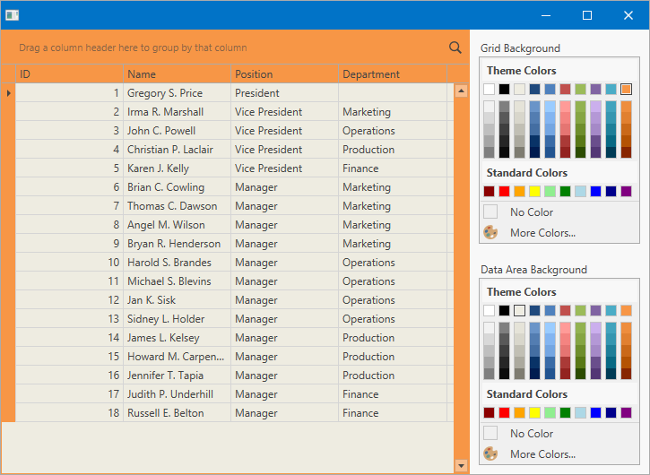

<!-- default badges list -->

<!-- default badges end -->
# How to Specify Data Grid Background

Use the [GridControl.Background](https://docs.devexpress.com/WPF/DevExpress.Xpf.Grid.GridControl.Background?v=20.2)/[TreeListControl.Background](https://docs.devexpress.com/WPF/DevExpress.Xpf.Grid.TreeListControl.Background?v=20.2) and [DataAreaBackground](https://docs.devexpress.com/WPF/DevExpress.Xpf.Grid.DataControlBase.DataAreaBackground?v=20.2) properties to change the background of the GridControl/TreeListControl and its data area.

This example allows you to use the [ColorEdit](https://docs.devexpress.com/WPF/DevExpress.Xpf.Editors.ColorEdit?v=20.2&p=netframework) controls to specify the `Background` and `DataAreaBackground` properties.

